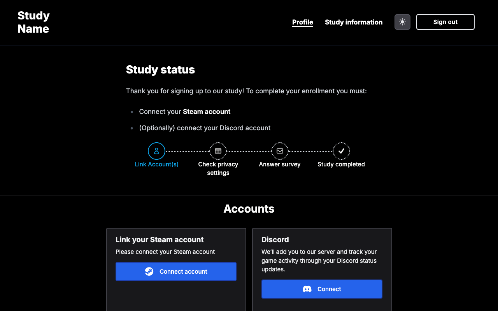

# GLHF — Game Log Harvesting Framework

[](LICENSE)
[](https://nodejs.org/)
[](https://glhf-lab.github.io/glhf/)

An open-source data donation platform for gameplay behavior research. GLHF collects consented play data from Steam via account linking, manages study participation workflows, and integrates with survey platforms (Qualtrics, Prolific).

> **[Read the documentation →](https://glhf-lab.github.io/glhf/)**



## Features

- Passwordless authentication (email magic links, Google, Discord)
- Steam account linking and automated play data collection (requires participants to set game activity to public on their Steam profile)
- Informed consent management
- Study progress tracking with configurable timelines
- Qualtrics and Prolific integration
- Participant data deletion support
- Configurable study name and branding via Strapi admin panel
- [Discord bot](https://github.com/glhf-lab/discord-bot) for gameplay activity tracking

## Quick Start

```bash
git clone https://github.com/glhf-lab/glhf.git
cd glhf
cd backend && yarn install && cp .env.example .env   # configure secrets
cd ../frontend && yarn install && cp .env.example .env
cd .. && yarn develop
# Visit http://localhost:3000
```

See the [full Getting Started guide](https://glhf-lab.github.io/glhf/docs/getting-started) for detailed setup instructions including secret generation and API token configuration.

## Documentation

The documentation covers:

- [Getting Started](https://glhf-lab.github.io/glhf/docs/getting-started) — Local development setup
- [Architecture](https://glhf-lab.github.io/glhf/docs/architecture) — System components and data flow
- [Environment Variables](https://glhf-lab.github.io/glhf/docs/configuration/environment-variables) — Full configuration reference
- [Deployment](https://glhf-lab.github.io/glhf/docs/deployment) — Docker production setup
- [Integrations](https://glhf-lab.github.io/glhf/docs/integrations/steam) — Steam, Qualtrics, Prolific, Discord, Slack

## Contributing

We welcome contributions — new game platforms, survey integrations, UI improvements, and more. See the [Contributing guide](https://glhf-lab.github.io/glhf/docs/contributing).

## License

MIT
