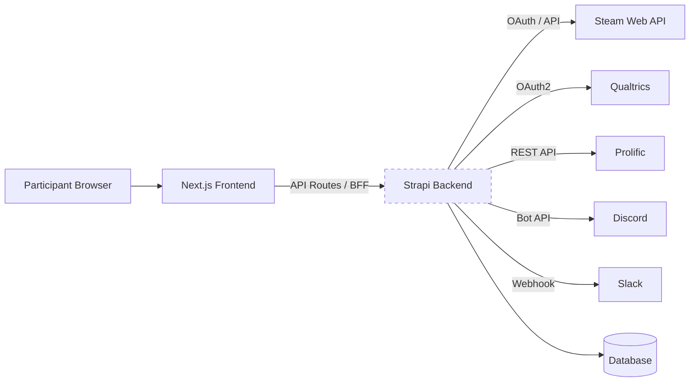
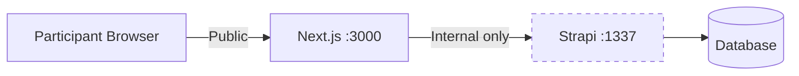

# Architecture

GLHF is a monorepo with a **Next.js 14** frontend and **Strapi 4** headless CMS backend.

## System Overview

## Backend-for-Frontend (BFF) Pattern

In our deployments **the Strapi backend is not publicly accessible**. All participant-facing requests are routed through the Next.js frontend, which acts as a **Backend-for-Frontend (BFF)**:

- **Next.js API routes** (`frontend/pages/api/`) proxy requests to Strapi, handling authentication, session management, and request shaping
- **Server-side rendering** (`getStaticProps` / `getServerSideProps`) fetches content from Strapi at build or request time
- **GraphQL queries** from the frontend to Strapi happen server-side only — the browser never talks to Strapi directly
- In production, the Strapi API is accessible only by the Next.js container on an internal network. The Strapi admin panel is exposed through a reverse proxy that handles authorization, so researchers can log in to manage content

This pattern limits the public attack surface while still giving researchers access to the admin panel, and lets the frontend control exactly what data is exposed to participants.

:::info How we deploy this
In our production setup, Strapi's API and PostgreSQL sit on an internal Docker network accessible only by the Next.js container. The Strapi admin panel is selectively exposed through a Cloudflare tunnel and Traefik reverse proxy, with Authelia 2FA gating access for researchers. See [Deployment](deployment) for the full details and our Ansible-based setup.
:::

## Components

### Frontend (Next.js 14)

The participant-facing application and BFF layer:
- Sign-up and authentication (NextAuth with email magic links, Google, Discord)
- Informed consent flow
- Account linking (Steam, Discord)
- Study progress tracking
- **API routes** that proxy and transform requests to the backend

Pages use a catch-all `[[...slug]].js` route for CMS-driven content, plus dedicated routes for `/profile` and `/login`. Global data (navbar, footer, study name) is fetched server-side via GraphQL.

### Backend (Strapi 4)

The internal headless CMS provides:
- Content management for pages, navigation, and study configuration
- Custom REST APIs for platform-specific logic
- Cron jobs for automated data collection and survey workflows
- User management with email hashing (HMAC SHA3-256)

The backend communicates with the frontend via **GraphQL** (`/graphql`) and REST endpoints, but only over the internal network — never directly to participants' browsers.

### Database

- **SQLite** in development (zero config)
- **PostgreSQL** in production (via Docker)

## Custom APIs

Located in `backend/src/api/`, these handle platform-specific logic:

| API | Purpose |
|-----|---------|
| `steam-user` | Steam account linking and data retrieval |
| `discord-user` | Discord account linking |
| `verification-token` | Passwordless auth token management |
| `crypto` | RSA-OAEP + AES-256-CBC encryption, HMAC hashing |
| `profile` | Participant profile management |
| `data-deletion-request` | GDPR-style data deletion requests |
| `prolific-invite` | Prolific recruitment integration |
| `steam-owned-games-sync-job` | Queue-based owned games sync |
| `steam-profile-sync-job` | Queue-based profile data sync |
| `global` | Site-wide configuration (study name, metadata) |

## Cron Jobs

Defined in `backend/config/cron-tasks.js`, these automate the study lifecycle:

| Job | Schedule Env Var | Purpose |
|-----|-----------------|---------|
| `steamFetch` | `STEAM_FETCH_CRON_SCHEDULE` | Fetch recently played games for all linked participants |
| `ownedGamesSync` | `STEAM_OWNED_GAMES_SYNC_CRON_SCHEDULE` | Sync owned games library |
| `steamProfileSync` | `STEAM_PROFILE_SYNC_CRON_SCHEDULE` | Sync Steam profile data |
| `qualtricsEmailImport` | `SURVEY_EMAIL_IMPORT_CRON_SCHEDULE` | Import participant emails into Qualtrics mailing list |
| `activateSurveys` | `SURVEY_ACTIVATE_CRON_SCHEDULE` | Trigger surveys for eligible participants and check study completion |
| `prolificDigest` | `PROLIFIC_DIGEST_CRON_SCHEDULE` | Process Prolific participant digest |
| `removeTokens` | `REMOVE_TOKENS_CRON_SCHEDULE` | Clean up expired verification tokens |
| `purgeUsers` | `PURGE_USERS_CRON_SCHEDULE` | Remove lingering incomplete registrations |

Most jobs are toggled via `*_ENABLED` environment variables (e.g., `SURVEY_ACTIVATE_CRON_SCHEDULE_ENABLED=false`).

## Data Flow

The typical participant journey through the system:

1. **Sign up** — Participant creates an account via passwordless email, Google, or Discord OAuth
2. **Consent** — Participant reviews and accepts the informed consent form
3. **Link Steam** — Participant links their Steam account via OpenID
4. **Data collection** — Cron jobs periodically fetch recently played games, owned games, and profile data from Steam
5. **Survey trigger** — After `STUDY_DAYS_BEFORE_SURVEY` days, the survey activation cron distributes a Qualtrics survey
6. **Completion** — After `STUDY_END_DAYS_AFTER_SURVEY` days post-survey, the study is marked complete
