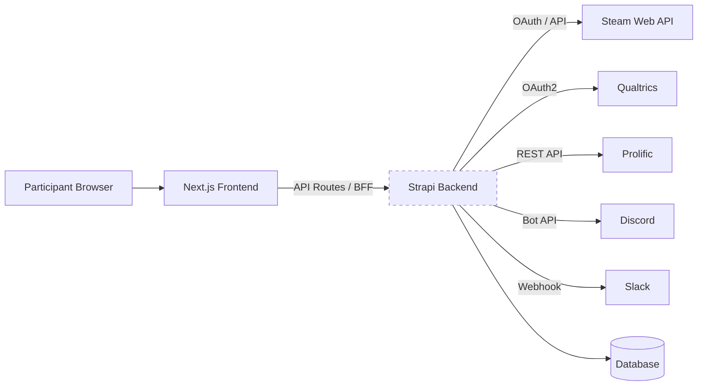
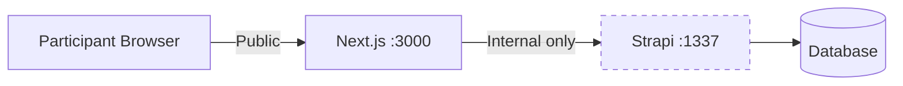
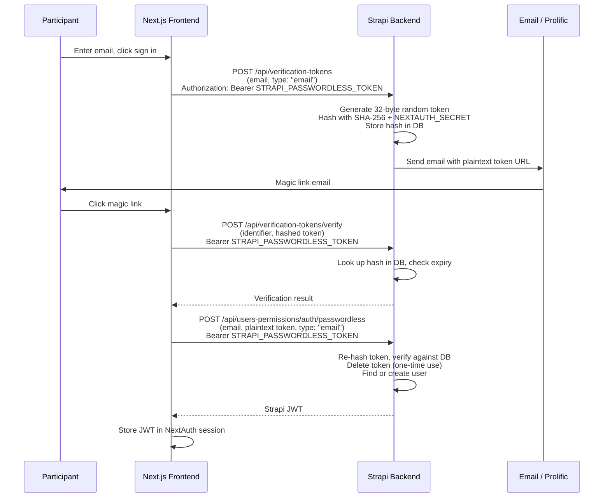
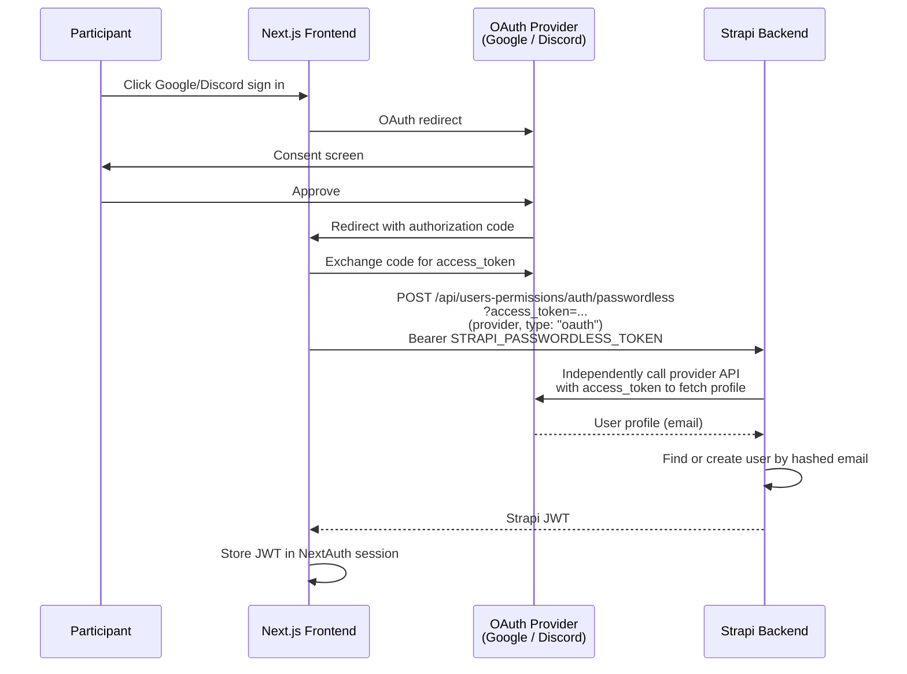
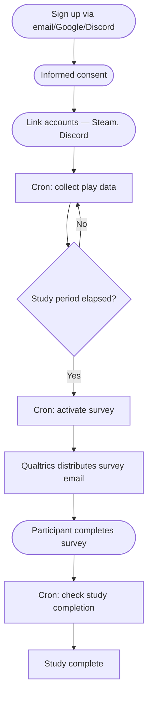

# Architecture

GLHF is a monorepo with a **Next.js 14** frontend and **Strapi 4** headless CMS backend.

## System Overview

## Backend-for-Frontend (BFF) Pattern

In our deployments **the Strapi backend is not publicly accessible**. All participant-facing requests are routed through the Next.js frontend, which acts as a **Backend-for-Frontend (BFF)**:

- **Next.js API routes** (`frontend/pages/api/`) proxy requests to Strapi, handling authentication, session management, and request shaping
- **Server-side rendering** (`getStaticProps` / `getServerSideProps`) fetches content from Strapi at build or request time
- **GraphQL queries** from the frontend to Strapi happen server-side only — the browser never talks to Strapi directly
- In production, the Strapi API is accessible only by the Next.js container on an internal network. The Strapi admin panel is exposed through a reverse proxy that handles authorization, so researchers can log in to manage content

This pattern limits the public attack surface while still giving researchers access to the admin panel, and lets the frontend control exactly what data is exposed to participants.

:::info How we deploy this
In our production setup, Strapi's API and PostgreSQL sit on an internal Docker network accessible only by the Next.js container. The Strapi admin panel is selectively exposed through a Cloudflare tunnel and Traefik reverse proxy, with Authelia 2FA gating access for researchers. See [Deployment](deployment) for the full details and our Ansible-based setup.
:::

## Components

### Frontend (Next.js 14)

The participant-facing application and BFF layer:
- Sign-up and authentication (NextAuth with email magic links, Google, Discord)
- Informed consent flow
- Account linking (Steam, Discord)
- Study progress tracking
- **API routes** that proxy and transform requests to the backend

Pages use a catch-all `[[...slug]].js` route for CMS-driven content, plus dedicated routes for `/profile` and `/login`. Global data (navbar, footer, study name) is fetched server-side via GraphQL.

### Backend (Strapi 4)

The internal headless CMS provides:
- Content management for pages, navigation, and study configuration
- Custom REST APIs for platform-specific logic
- Cron jobs for automated data collection and survey workflows
- User management with email hashing (HMAC SHA3-256)

The backend communicates with the frontend via **GraphQL** (`/graphql`) and REST endpoints, but only over the internal network — never directly to participants' browsers.

### Database

- **SQLite** in development (zero config)
- **PostgreSQL** in production (via Docker)

## Authentication

Authentication uses [NextAuth](https://next-auth.js.org/) with a JWT session strategy and a custom `StrapiAdapter`. Three sign-in methods are supported: **email magic link**, **Google OAuth**, and **Discord OAuth**. Each is toggleable via environment variables (`EMAIL_SIGNIN_ENABLED`, `GOOGLE_SIGNIN_ENABLED`, `DISCORD_SIGNIN_ENABLED`).

The backend never trusts tokens or credentials forwarded by the frontend — it independently verifies everything before issuing a Strapi JWT.

### Email magic link flow

### OAuth flow (Google / Discord)

### Backend trust model

The backend independently validates every piece of authentication data:

| What the frontend sends | How the backend validates it |
|---|---|
| Email verification token | Re-hashes with SHA-256 + `NEXTAUTH_SECRET`, checks against DB, enforces expiry, deletes after use (one-time) |
| OAuth `access_token` | Calls the OAuth provider's API directly to fetch the user profile — never trusts the email from the frontend |
| All auth requests | Gated by `hasTokenPermission` policy — requires a Strapi API token with the specific `getJwtFromEmail` permission |
| Email addresses | Hashed with HMAC-SHA3-256 before storage and lookup — plaintext emails are never persisted |

### The `STRAPI_PASSWORDLESS_TOKEN`

This is a **Strapi API token** created in the admin panel, separate from participant authentication. It proves the caller is the authorized frontend, not an arbitrary client. All three auth flows above include it as a `Bearer` token. On the backend, the `hasTokenPermission` policy checks that the API token has the `plugin::users-permissions.auth.getJwtFromEmail` permission before allowing any auth request through.

## Rate Limiting

Rate limiting is implemented at two layers: the **frontend** (public-facing, per-IP and per-email) and the **backend** (defense-in-depth, per-identifier). They protect against different threat models.

### Frontend (public-facing)

The frontend rate limits protect against abuse from the public internet. Defined in `frontend/src/pages/api/auth/[...nextauth].js` and `frontend/src/pages/api/auth/create-verification-token.js`, using an LRU-cache-based limiter (`frontend/src/lib/rate-limiter.js`).

| Limiter | Key | Limit | Window | Scope |
|---------|-----|-------|--------|-------|
| General NextAuth | Client IP | 30 req | 1 min | All NextAuth routes |
| Email sign-in (IP) | Client IP | 10 req | 15 min | `POST .../signin/email` only |
| Email sign-in (email) | Email address | 3 req | 15 min | `POST .../signin/email` only |
| M2M token endpoint | Client IP (failed attempts) | 5 failures | 1 min interval, 15 min block | `POST /api/auth/create-verification-token` |

**Design choices:**
- Email sign-in limits return a **fake success response** (`200` with redirect URL) rather than `429`, to avoid leaking whether an email is registered
- The M2M token endpoint uses a **failed-attempt limiter** — only failed auth attempts count, and exceeding the threshold blocks the IP for 15 minutes
- OAuth sign-ins are not rate-limited on the frontend because the OAuth providers (Google, Discord) enforce their own rate limits on token exchanges

### Backend

Backend rate limits exist for the **compromised frontend** scenario — an attacker has obtained `STRAPI_PASSWORDLESS_TOKEN` and calls Strapi directly. Since the backend is not publicly exposed, all legitimate requests come from the frontend server's single IP, making IP-based limiting useless.

Instead, limits are **per-identifier** (email or token identifier from the request body), implemented as a reusable Strapi policy (`backend/src/policies/rate-limit.js`). Tokens are 32-byte random, so brute-force protection here is more about anomaly detection.

| Route | Key | Limit | Window | Rationale |
|-------|-----|-------|--------|-----------|
| `POST /api/verification-tokens` (create) | `body.identifier` | 3 req | 15 min | Caps token creation per email — limits email spam |
| `POST /api/verification-tokens/verify` | `body.identifier` | 20 req | 1 min | Anomaly detection |
| `POST /auth/passwordless` (email only) | `body.email` | 20 req | 1 min | Anomaly detection |

**Design choices:**
- **No IP-based fallback** — if no `keyFn` is provided, the policy logs a warning and allows the request through (fail-open with visibility), rather than silently using an ineffective IP key
- **OAuth bypasses backend rate limiting** — OAuth requests to `/auth/passwordless` have no `email` in the body (the email is resolved from the OAuth provider inside the handler), so `keyFn` returns `undefined` and the request passes through. This is intentional: OAuth tokens can't be brute-forced, and the providers enforce their own limits
- Rate limit keys are **hashed with a per-boot salt** before logging, so emails/identifiers don't appear in plaintext in logs

Additionally, auth-related paths can be rate-limited at the edge (e.g. Cloudflare rate limiting rules) for IP-based protection before requests reach the application layer.

## Custom APIs

Located in `backend/src/api/`, these handle platform-specific logic:

| API | Purpose |
|-----|---------|
| `steam-user` | Steam account linking and data retrieval |
| `discord-user` | Discord account linking |
| `verification-token` | Passwordless auth token management |
| `crypto` | RSA-OAEP + AES-256-CBC encryption, HMAC hashing |
| `profile` | Participant profile management |
| `data-deletion-request` | GDPR-style data deletion requests |
| `prolific-invite` | Prolific recruitment integration |
| `steam-owned-games-sync-job` | Queue-based owned games sync |
| `steam-profile-sync-job` | Queue-based profile data sync |
| `global` | Site-wide configuration (study name, metadata) |

## Cron Jobs

Defined in `backend/config/cron-tasks.js`, these automate the study lifecycle:

| Job | Schedule Env Var | Purpose |
|-----|-----------------|---------|
| `steamFetch` | `STEAM_FETCH_CRON_SCHEDULE` | Fetch recently played games for all linked participants |
| `ownedGamesSync` | `STEAM_OWNED_GAMES_SYNC_CRON_SCHEDULE` | Sync owned games library |
| `steamProfileSync` | `STEAM_PROFILE_SYNC_CRON_SCHEDULE` | Sync Steam profile data |
| `qualtricsEmailImport` | `SURVEY_EMAIL_IMPORT_CRON_SCHEDULE` | Import participant emails into Qualtrics mailing list |
| `activateSurveys` | `SURVEY_ACTIVATE_CRON_SCHEDULE` | Trigger surveys for eligible participants and check study completion |
| `prolificDigest` | `PROLIFIC_DIGEST_CRON_SCHEDULE` | Process Prolific participant digest |
| `removeTokens` | `REMOVE_TOKENS_CRON_SCHEDULE` | Clean up expired verification tokens |
| `purgeUsers` | `PURGE_USERS_CRON_SCHEDULE` | Remove lingering incomplete registrations |

Most jobs are toggled via `*_ENABLED` environment variables (e.g., `SURVEY_ACTIVATE_CRON_SCHEDULE_ENABLED=false`).

## Data Flow

The typical participant journey through the system:

1. **Sign up** — Participant creates an account via passwordless email, Google, or Discord OAuth
2. **Consent** — Participant reviews and accepts the informed consent form
3. **Link Steam** — Participant links their Steam account via OpenID
4. **Data collection** — Cron jobs periodically fetch recently played games, owned games, and profile data from Steam
5. **Survey trigger** — After `STUDY_DAYS_BEFORE_SURVEY` days, the survey activation cron distributes a Qualtrics survey
6. **Completion** — After `STUDY_END_DAYS_AFTER_SURVEY` days post-survey, the study is marked complete
