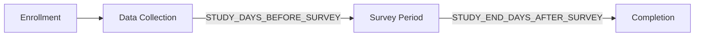

# Study Parameters

GLHF provides configurable parameters to control the study lifecycle, requirements, and participant-facing branding.

## Study Lifecycle

The study follows a linear progression for each participant:

### Phases

1. **Enrollment** — Participant signs up, consents, and links required accounts (Steam, optionally Discord)
2. **Data Collection** — Cron jobs collect Steam play data for `STUDY_DAYS_BEFORE_SURVEY` days
3. **Survey Period** — A Qualtrics survey is distributed; reminders sent after `STUDY_SURVEY_REMINDER_DAYS` days; link expires after `STUDY_SURVEY_EXPIRATION_DAYS` days
4. **Completion** — Study is marked complete `STUDY_END_DAYS_AFTER_SURVEY` days after the survey is sent

### Timeline Variables

| Variable | Description | Default |
|----------|-------------|---------|
| `STUDY_DAYS_BEFORE_SURVEY` | Days of play data collection before survey | `7` |
| `STUDY_SURVEY_EXPIRATION_DAYS` | Days before the survey link expires | `7` |
| `STUDY_SURVEY_REMINDER_DAYS` | Days after survey send to send a reminder | `3` |
| `STUDY_END_DAYS_AFTER_SURVEY` | Days after survey send before marking complete | `14` |

**Example timeline:** With defaults, a participant who enrolls on Day 0 receives their survey on Day 7, a reminder on Day 10, the link expires on Day 14, and the study completes on Day 21.

## Study Name

The participant-facing study name (e.g., "GamingStudy") is configured in the **Strapi admin panel**:

1. Go to **Content Manager → Global** (single type)
2. Set the `studyName` field

This name appears in:
- Email communications (magic links, survey invites)
- Discord bot messages
- Site footer
- Survey invite headers (Qualtrics `fromName`)

`studyName` is one of several fields on the Global single type. See [CMS Content Configuration](cms-content.md#global-single-type) for the full set of configurable Global fields.

## Enrollment Requirements

These flags control what accounts participants must link before the study begins collecting data:

| Variable | Description | Default |
|----------|-------------|---------|
| `STEAM_REQUIRED` | Participant must link a Steam account | `true` |
| `DISCORD_REQUIRED` | Participant must link a Discord account | _(empty = not required)_ |

### Steam Visibility Requirements

Additional flags control what Steam data must be accessible:

| Variable | Description | Default |
|----------|-------------|---------|
| `STEAM_REQUIRE_OWNED_GAMES` | Participant must have owned games on Steam | `false` |
| `STEAM_REQUIRE_PLAYTIME_PUBLIC` | Participant's playtime must be publicly visible | `true` |
| `STEAM_REQUIRE_RECENT_PLAYTIME` | Participant must have recent playtime data | `false` |

These are checked when a participant links their Steam account. If requirements aren't met, the participant is informed about what needs to change in their Steam privacy settings.
