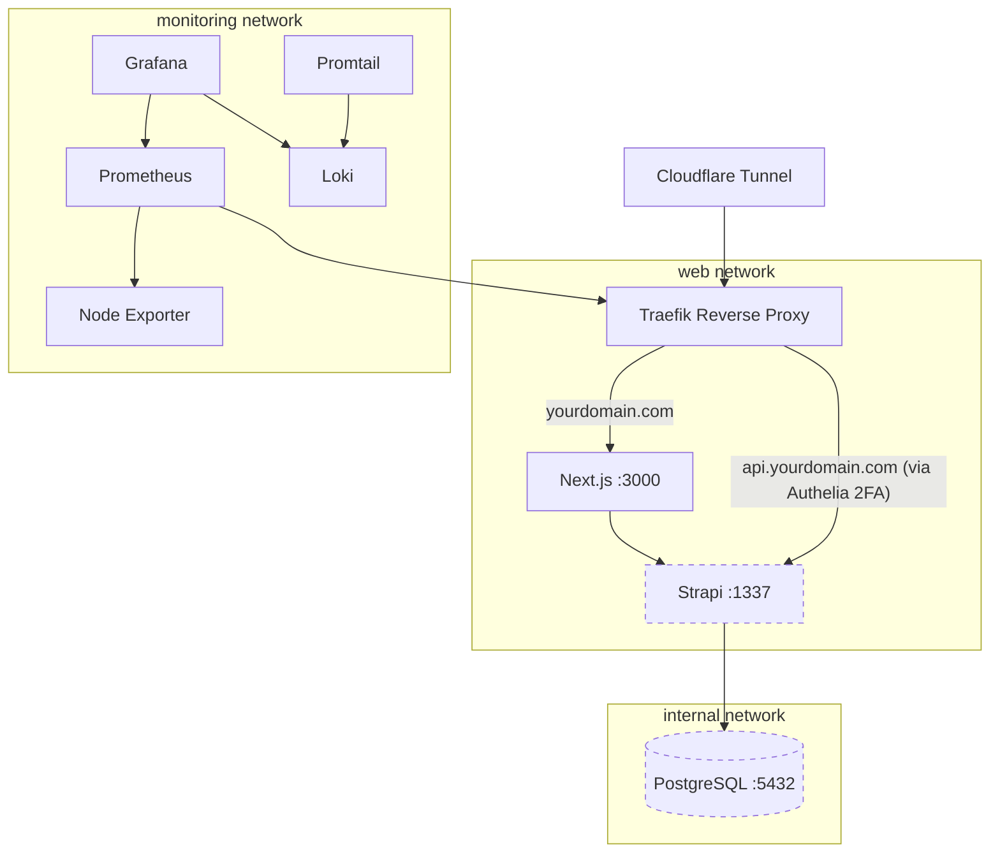

# Deployment

GLHF is a standard Next.js + Strapi application. You can deploy it however you like — Docker, bare metal, a PaaS, or any combination. The only hard requirements are Node.js 18–20, a PostgreSQL database for production, and a reverse proxy for HTTPS.

In our deployment, the Strapi API is not publicly accessible — participant traffic goes through the Next.js BFF layer, and the admin panel is gated behind 2FA (see [Architecture](architecture)). This is to reduce the public attack surface.

## What You Need

At minimum, a production deployment requires:

- **A server** — a VPS, dedicated machine, or any host that can run Docker or Node.js
- **Next.js frontend** serving participants and proxying to Strapi
- **Strapi backend** serving the API and admin panel
- **PostgreSQL** database
- **Reverse proxy** terminating HTTPS in front of the frontend
- Environment variables configured for both services (see [Environment Variables](configuration/environment-variables))

## Post-Deploy Setup

Regardless of how you deploy, these steps are needed on first run:

1. **Import Strapi config** — Run `yarn import` in the backend to load the seed data
2. **Create an admin user** — Visit the Strapi admin panel (`/admin`)
3. **Generate an API token** — In Strapi admin, go to **Settings → API Tokens** and create a token with permissions: `Verification-token: create, verify, findOne` and `User-permissions.Auth: getJwtFromEmail`. Set this as `STRAPI_PASSWORDLESS_TOKEN` in the frontend
4. **Configure the study** — In **Content Manager → Global**, set the `studyName` and other site-wide settings

---

## Reference: Our Deployment

The rest of this page documents how the GLHF team deploys the platform. This is provided as a reference — none of these specific tools are required.

We use **Ansible** from a separate [infrastructure repository](https://github.com/glhf-lab/infrastructure) to manage server provisioning, container orchestration, secrets, and monitoring.

### Production Architecture



| Service | Purpose |
|---------|---------|
| **Cloudflare Tunnel** | Secure ingress without exposing server ports |
| **Traefik** | Reverse proxy with automatic Let's Encrypt TLS (Cloudflare DNS challenge) |
| **Authelia** | 2FA gateway protecting the Strapi admin panel |
| **Prometheus / Grafana / Loki** | Monitoring, dashboards, and log aggregation |

### Docker Networks

| Network | Type | Connects |
|---------|------|----------|
| `web` | External | Traefik, Frontend, Backend |
| `internal` | Internal | Backend, PostgreSQL |
| `monitoring` | Internal | Prometheus, Grafana, Loki, Promtail, Node Exporter |

PostgreSQL is on the `internal` network — never directly reachable from the internet. The backend is on both networks: the `web` network for proxy access (participant traffic via Next.js, admin access via Authelia 2FA) and the `internal` network for database access.

### Ansible Repository

The [`infrastructure`](https://github.com/glhf-lab/infrastructure) repository handles the full lifecycle:

```
infrastructure/
  provision.yml               # Initial server hardening
  containers.yml              # Application deployment
  monitoring.yml              # Monitoring stack
  staging / production        # Inventory files
  infrastructure-secrets/     # Git submodule with Ansible Vault-encrypted secrets
  roles/
    common, ssh, ufw,         # Server hardening
    fail2ban, postfix, ...
    traefik, authelia,        # Reverse proxy + 2FA
    cloudflare-tunnel/        # Secure ingress
    backend, frontend,        # Application containers
    discord-bot/
    docker-common/            # Shared build/archive/deploy tasks
    prometheus, grafana,      # Monitoring
    loki, promtail,
    alertmanager,
    node-exporter/
  one-offs/                   # Backup, restore, migration utilities
```

### Secret Management

Secrets are encrypted with **Ansible Vault** in the `infrastructure-secrets` submodule. Encrypted values use a `VAULT_` prefix and are referenced in plain config:

```yaml
# In vault (encrypted)
VAULT_DATABASE_PASSWORD: "..."
VAULT_STEAM_API_KEY: "..."

# In staging.yml (plain)
DATABASE_PASSWORD: "{{ VAULT_DATABASE_PASSWORD }}"
STEAM_API_KEY: "{{ VAULT_STEAM_API_KEY }}"
```

### Deployment Phases

#### Phase 1: Server Provisioning

```bash
ansible-playbook provision.yml -k -l "host"
```

Runs once per server: package updates, SSH hardening, UFW firewall, fail2ban, unattended upgrades, rootless Docker, OS hardening baseline.

#### Phase 2: Infrastructure

```bash
ansible-playbook containers.yml -l "host" --skip-tags="frontend" --extra-vars "force_build=true"
```

Deploys Cloudflare Tunnel, Traefik (reverse proxy + TLS), and Authelia (2FA).

#### Phase 3: Application

```bash
# Backend
ansible-playbook containers.yml -l "host" --tags="backend" --extra-vars "force_build=true"

# Frontend
ansible-playbook containers.yml -l "host" --tags="frontend" --extra-vars "force_build=true"
```

Each role: clones the repo at the configured branch → builds a Docker image → archives as a gzipped tarball → transfers to the server → loads into Docker → starts the container with environment, networks, volumes, and Traefik labels.

#### Phase 4: Monitoring

```bash
ansible-playbook monitoring.yml -l "host"
```

Deploys Node Exporter, Prometheus, Alertmanager (email + Slack), Loki, Promtail, and Grafana with provisioned datasources and dashboards.

### Build Control

```bash
--extra-vars "force_build=true"   # Rebuild even if source unchanged
--extra-vars "no_cache=true"      # Build without Docker cache
--extra-vars "force_deploy=true"  # Force container redeployment
--tags="backend"                  # Target specific services
```

### Operations Playbooks

| Playbook | Purpose |
|----------|---------|
| `one-offs/backup-backend-db.yml` | Dump PostgreSQL, compress, fetch locally |
| `one-offs/restore-backend-db.yml` | Stop backend, restore from backup, restart |
| `one-offs/migrate-backend.yml` | Copy database between environments |
| `one-offs/download_backend_data.yml` | Export participant data (GDPR compliance) |

### Security Layers

- Docker rootless mode (non-root containers)
- Network isolation (DB on internal-only network, backend access authorized at the edge via Authelia 2FA)
- `cap_drop: all` + `no-new-privileges` on all containers
- UFW firewall (default deny, SSH only)
- OS hardening via [devsec.hardening](https://dev-sec.io/) Ansible collection
- SSH key-only auth, root login disabled
- Fail2Ban rate limiting
- Let's Encrypt TLS via Cloudflare DNS challenge
- Authelia 2FA for admin interfaces
- Ansible Vault encryption for all secrets
- Centralized logging via Loki
