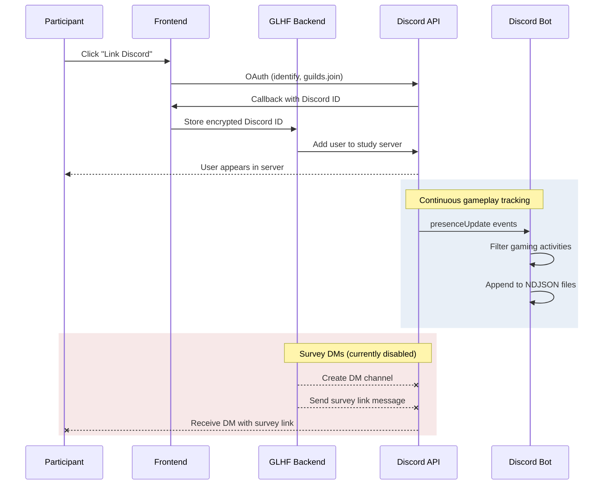

# Discord Integration

GLHF uses Discord for **gameplay activity tracking** and **participant communication**. Participants link their Discord account and are automatically added to a study Discord server, where a separate Discord bot ([`discord-bot`](#gameplay-tracking-bot)) tracks their gameplay via Discord Rich Presence events. The bot is a standalone Node.js service — it is not part of the GLHF backend.

Discord can also be used as an [OAuth sign-in provider](#oauth-sign-in). Infrastructure for [sending survey DMs](#survey-dms) exists but is currently disabled.

## Setup

### Discord Application Setup

1. Go to the [Discord Developer Portal](https://discord.com/developers/applications)
2. Create a new application
3. Under **Bot**, click "Add Bot"
4. Copy the bot token
5. Enable the **Server Members Intent** and **Presence Intent** under **Bot → Privileged Gateway Intents**
6. Under **OAuth2**, configure the redirect URL: `{NEXTAUTH_URL}/api/auth/callback/discord`

The bot needs the following permissions:

- **Send Messages** — to DM participants survey links
- **Read Message History** — for DM context
- **Manage Guild Members** — to add and remove users from the study server

OAuth2 scopes required for account linking: `identify guilds.join`

Generate an invite URL with the required permissions and add the bot to your study's Discord server.

### Environment Variables

**Backend `.env`:**

```bash
DISCORD_BOT_TOKEN=your_bot_token
DISCORD_GUILD=your_guild_id        # right-click server → Copy Server ID
DISCORD_REQUIRED=false             # set to "true" to require Discord linking before activation
```

**Frontend `.env`:**

```bash
DISCORD_SIGNIN_ENABLED=true
DISCORD_CLIENT_ID=your_client_id    # from Discord Developer Portal → OAuth2
DISCORD_CLIENT_SECRET=your_secret
DISCORD_BOT_TOKEN=your_bot_token    # same token, used for account linking
```

## CMS Configuration

The Discord card's visibility and text content are configured in the Strapi admin panel. See [CMS Content Configuration](../configuration/cms-content.md#integration-cards-accounts-dynamic-zone) for all configurable fields.

## How Account Linking Works

Account linking is separate from OAuth sign-in. It connects a participant's Discord identity to their study profile and adds them to the study server.

### Linking Flow

1. Participant clicks "Link Discord" on their profile page
2. OAuth flow initiates with `identify guilds.join` scopes (different from sign-in, which uses `identify email`)
3. Backend receives the participant's Discord ID and OAuth access token
4. Discord ID is **encrypted** (AES-256-CBC) and **hashed** (HMAC SHA3-256) for storage — the encrypted value is stored for decryption when needed (e.g., sending DMs), while the hash is used for lookups and cross-referencing
5. Backend calls the Discord API to **add the user to the study server** (`PUT /guilds/{guild_id}/members/{user_id}`) using the OAuth access token
6. `discordLinked` flag is set to `true` on the user record
7. If all required accounts are linked, the study activation dates are calculated

**Error handling:**

- **Rate limits (429):** Retried with exponential backoff (up to 5 retries)
- **Server limit (code 30001):** User is in too many Discord servers — returned as a `discordServerLimit` error to the frontend
- **Duplicate linking:** If the Discord account is already linked to another user, a `accountAlreadyConnectedToOtherUser` error is returned

### Unlinking Flow

1. Participant clicks "Unlink Discord" on their profile page
2. Backend decrypts the stored Discord ID
3. Backend **kicks the user from the study server** (`DELETE /guilds/{guild_id}/members/{user_id}`)
4. `discordLinked` flag is set to `false`

## Gameplay Tracking Bot

The gameplay tracking bot is a standalone Node.js service in the [`discord-bot`](https://github.com/glhf-lab/discord-bot) repository. It monitors Discord Rich Presence events on the study server to record participants' gameplay activity. It runs independently from the GLHF backend and does not share a database.

### What It Tracks

The bot listens for `presenceUpdate` events and records activities of the following types:

| Type Code | Activity Type |
|-----------|--------------|
| 0 | Playing |
| 1 | Streaming |
| 5 | Competing |

For each activity, the following fields are recorded:

- **Game info:** `name`, `applicationId`, `type`, `url`
- **Rich Presence details:** `details`, `state`, `party`, `assets`, `flags`, `emoji`, `buttons`
- **Timestamps:** `timestamps.start`, `timestamps.end`, `createdTimestamp`
- **Bot-added metadata:** `userId`, `updateType`, `saveTimeStamp`, `status`, `clientStatus`

The `updateType` field is derived by the bot (not provided by Discord) by comparing the old and new presence activity arrays on each `presenceUpdate` event. The bot matches activities by game `name`:

- `startedPlaying` — activity is in the new presence but **not** in the previous one
- `isPlaying` — activity is in **both** the new and previous presence (still ongoing)
- `stoppedPlaying` — activity was in the previous presence but **not** in the new one (the bot copies the old activity data and tags it as stopped)

The `clientStatus` field shows which Discord clients are active (e.g., `{"desktop": "online", "mobile": "offline"}`).

The bot also tracks server membership events: `guildMemberAdd` and `guildMemberRemove`.

### Data Storage

Data is stored as NDJSON (newline-delimited JSON) files on the filesystem, with hourly file rotation for activity data:

```
data/
  activities/
    2025/
      01/
        15/
          00/activities.json
          01/activities.json
          ...
        16/
          ...
  guildMemberAdd.json
  guildMemberRemove.json
```

- **Activity files** are rotated hourly — a new write stream is created each hour at `data/activities/{year}/{month}/{day}/{hour}/activities.json`
- **Membership event files** are global append-only files

**Sample activity record:**

```json
{
  "name": "Hollow Knight",
  "type": 0,
  "url": null,
  "details": null,
  "state": null,
  "applicationId": "000000000000000000",
  "timestamps": { "start": "1687431285189", "end": null },
  "party": null,
  "assets": null,
  "flags": 0,
  "emoji": null,
  "buttons": [],
  "createdTimestamp": 1687433138804,
  "userId": "a1b2c3d4e5f6...",
  "updateType": "isPlaying",
  "saveTimeStamp": 1709030128069,
  "status": "online",
  "clientStatus": { "desktop": "online" }
}
```

**Sample membership event record:**

```json
{ "user": "a1b2c3d4e5f6...", "timeStamp": 1706887605808 }
```

### Privacy

- Discord IDs can be hashed using HMAC SHA3-256 by setting `HASH_IDS=true`
- When the same `SECRET_HMAC_KEY` is used as the GLHF backend, hashed IDs can be cross-referenced between the two systems
- Data collection stops automatically when a user leaves the server

### Configuration

| Variable | Description |
|----------|-------------|
| `TOKEN` | Discord bot token |
| `GUILD` | Discord server ID to monitor |
| `HASH_IDS` | `true` to hash Discord user IDs with HMAC SHA3-256 |
| `SECRET_HMAC_KEY` | HMAC key for hashing (must match GLHF backend for cross-referencing) |

### Deployment

The bot runs as a Docker container with a volume mount for persistent data storage:

```yaml
services:
  bot:
    build: .
    image: glhf/discord-bot
    container_name: discord-bot
    volumes:
      - bot_data:/bot/data
    environment:
      - TOKEN
      - GUILD
      - HASH_IDS
      - SECRET_HMAC_KEY
volumes:
  bot_data:
```

The bot requires the **Server Members** and **Presence** privileged gateway intents to be enabled in the Discord Developer Portal.

:::info
The gameplay tracking bot is a standalone service in the [`discord-bot`](https://github.com/glhf-lab/discord-bot) repository. It runs independently from the GLHF backend and does not share a database. Cross-referencing participants between GLHF and the bot is done via hashed Discord IDs (using the same HMAC key).
:::

## OAuth Sign-In

Discord OAuth allows participants to sign up and sign in using their Discord account. This is configured through NextAuth in the frontend and uses the `identify email` scopes — separate from account linking, which uses `identify guilds.join`.

To enable:

1. In the Discord Developer Portal, go to **OAuth2**
2. Add redirect URL: `{NEXTAUTH_URL}/api/auth/callback/discord`
3. Set `DISCORD_SIGNIN_ENABLED=true` in the frontend `.env`

## Survey DMs

:::warning Disabled
Survey DMs are currently disabled in the codebase to avoid the bot being flagged by Discord for unsolicited messages. The code exists but is commented out in `activateSurvey.js`.
:::

The backend includes infrastructure to send a direct message with the Qualtrics survey link when a participant's survey is activated:

> Hey, two weeks ago you signed up to a research study on [your site]. It's now time to answer a short survey.
>
> Use this link to take the survey: [personalized link]

When enabled, this would run during the `activateSurveys` cron job for participants who have linked a Discord account. The DM helper retries up to 3 times with exponential backoff (1-minute base delay) on rate limits and network errors.

## Requirement Flag

Set `DISCORD_REQUIRED=true` in the backend `.env` to require participants to link a Discord account before data collection begins. When required, the study will not activate until both Discord (and Steam, if also required) are linked.

## Data Flow


