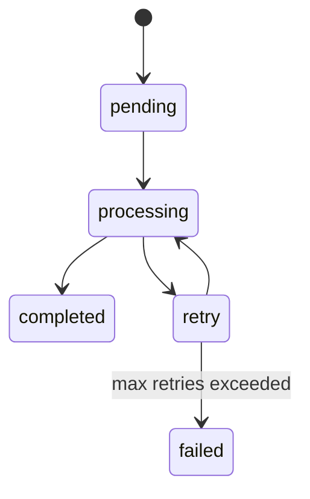
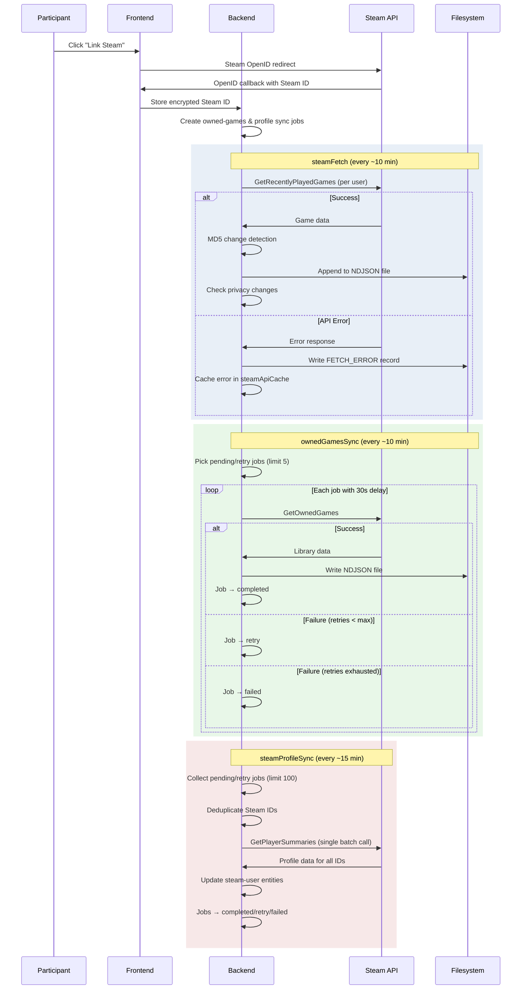

# Steam Integration

GLHF collects gameplay data from participants' Steam accounts via the public Steam Web API. Participants voluntarily link their accounts through Steam OpenID, and automated cron jobs collect play data throughout the study. Participants must set their game activity to public on their Steam profile for data collection to work — see [Steam Privacy Checks](#steam-privacy-checks) for details.

## Setup

### 1. Get a Steam Web API Key

Register for a key at [steamcommunity.com/dev/apikey](https://steamcommunity.com/dev/apikey). You need a Steam account with a purchased game.

### 2. Configure Environment Variables

Add the key to **both** backend and frontend `.env` files:

```bash
# Backend .env
STEAM_API_KEY=your_key_here
ENCRYPTION_KEY=your_generated_key  # for encrypting stored Steam IDs

# Frontend .env
STEAM_API_KEY=your_key_here
```

## CMS Configuration

The Steam card's visibility and text content are configured in the Strapi admin panel. See [CMS Content Configuration](../configuration/cms-content.md#integration-cards-accounts-dynamic-zone) for all configurable fields.

## Data Collection & Storage

### Database (Strapi Entities)

#### `steam-user`

Each linked Steam account creates a `steam-user` entity with:

| Field | Type | Description |
|-------|------|-------------|
| `steamid` | string | AES-256-CBC encrypted Steam ID |
| `steamidHashed` | string | Hashed Steam ID for indexed lookups |
| `communityvisibilitystate` | integer | `1` = private, `3` = public |
| `profilestate` | integer | Profile configuration state |
| `entityTag` | string | MD5 hash of last fetch result (change detection) |
| `steamApiCache` | JSON | Last fetch status, errors, timestamp, and cached response |
| `timecreated` | biginteger | Unix timestamp of Steam account creation |
| `lastProfileSyncAt` | datetime | When profile data was last synced |

#### User Flags on `users-permissions.user`

Steam-related boolean flags set on each participant's user record:

| Flag | Meaning |
|------|---------|
| `steamLinked` | User has linked a Steam account |
| `steamActivated` | User meets Steam activation criteria |
| `steamPrivate` | Profile visibility is not public (`communityvisibilitystate !== 3`) |
| `steamHasRecentPlayedGames` | Has games played in last 2 weeks |
| `steamHasOwnedGames` | Owned games data has been retrieved |
| `steamHasOwnedGamesPlaytime` | At least one owned game has `playtime_forever > 0` |
| `steamHasPlaytimePublic` | Recently-played API returns `total_count` (playtime is public) |

#### Sync Job Entities

Both `steam-owned-games-sync-job` and `steam-profile-sync-job` share a common structure:

| Field | Type | Description |
|-------|------|-------------|
| `status` | enum | `pending`, `processing`, `completed`, `failed`, or `retry` |
| `attempts` | integer | Number of processing attempts (starts at 0) |
| `lastAttemptAt` | datetime | When the job last entered `processing` |
| `errorMessage` | text | Diagnostic info from the last failure |
| `steamUser` | relation | Link to the associated `steam-user` entity |

### Filesystem (`.tmp/data/`)

Game data is stored as NDJSON files (newline-delimited JSON, one record per line):

**Recently played games** — appended to throughout the day:
- Path: `.tmp/data/recently-played-games/user-{userId}/{YYYY-MM-DD}-games.json`
- Fields per record: `userId`, `steamUserId`, `appid`, `name`, `playtime_forever`, `playtime_2weeks`, `playtime_mac_forever`, `playtime_linux_forever`, `playtime_windows_forever`, `timestamp`

**Owned games** — overwritten per sync:
- Path: `.tmp/data/owned-games/{YYYY-MM-DD}-user-{userId}.json`
- Fields per record: full Steam API game object + `userId`, `timestamp`
- Only written if the user has at least one owned game

```
.tmp/data/
  recently-played-games/
    user-1/
      2025-01-15-games.json
      2025-01-16-games.json
    user-2/
      ...
  owned-games/
    2025-01-15-user-1.json
    2025-01-15-user-2.json
```

:::info How we archive this data

In production, a daily cron job (2 AM) archives JSON files older than 24 hours from `.tmp/data/`. Files are tarred, gzipped, then **GPG-encrypted with multiple recipient public keys** (asymmetric encryption) before being uploaded to S3 via `s3cmd`. Local files are cleaned up after successful upload.

This archival process is managed by Ansible in the [`infrastructure`](https://github.com/glhf-lab/infrastructure) repository and is not part of GLHF itself.

:::

## Cron Jobs

Three cron jobs handle Steam data collection. All run whenever the backend is running.

### `steamFetch` — Recently Played Games

- **Schedule:** `STEAM_FETCH_CRON_SCHEDULE` (configurable via env var)
- **Scope:** All users where `steamid != null`, `consentedToResearch == true`, and `steamLinked == true`

**Rate limiting & retries:**
- Rate limited to **400 requests per 5 minutes** via `axios-rate-limit`
- Retries: **3 attempts** with **30-second linear backoff** (30s, 60s, 90s) via `axios-retry`
- Also retries on HTTP 429 (rate limit) responses

**Change detection:**
- Computes an MD5 hash of each fetch result and stores it as `entityTag` on the `steam-user`
- If the hash hasn't changed since the last fetch, the file write is skipped

**Error recording:**
- Fetch errors are written to the game file as a special record with `name: "FETCH_ERROR"`, including `errorCode` and `errorMessage` — this keeps the timeline complete even when fetches fail
- Errors are also cached in `steamApiCache` with `_lastFetchAttemptStatus`, `_lastFetchErrorCode`, `_lastFetchErrorMessage`, and `_lastFetchTimestamp`

**Privacy change detection:**
- Compares the `total_count` field between consecutive successful fetches
- If `total_count` disappears → playtime went private; logs `steamDataPrivate` event and updates user flags
- If `total_count` appears → playtime went public; logs `steamDataPublic` event and triggers an owned games re-sync (creates a new sync job if one isn't already pending/processing/retrying)

### `ownedGamesSync` — Owned Games Library

- **Schedule:** `STEAM_OWNED_GAMES_SYNC_CRON_SCHEDULE` (default: every 10 minutes)
- **Queue-based:** processes `steam-owned-games-sync-job` entities — jobs are queued rather than fetched inline to stay within Steam API rate limits and gracefully handle transient network errors without blocking the linking flow

**Configuration:**

| Variable | Default | Description |
|----------|---------|-------------|
| `STEAM_OWNED_GAMES_SYNC_JOB_LIMIT` | 5 | Jobs to process per cron run |
| `STEAM_OWNED_GAMES_SYNC_JOB_DELAY_MS` | 30000 | Delay between jobs (milliseconds) |
| `STEAM_OWNED_GAMES_SYNC_MAX_RETRIES` | 3 | Max retry attempts before marking failed |

**Job lifecycle:**



- Jobs are processed oldest-first (sorted by `createdAt`)
- Each API call has its own retry logic: 3 attempts with 1-second linear backoff
- **Timeout recovery:** jobs stuck in `processing` for 60+ minutes are automatically picked up and reset to retry
- **Deduplication:** only one job per user can exist in `pending`, `processing`, or `retry` status at a time

On success, updates user flags: `steamHasOwnedGames: true`, and `steamHasOwnedGamesPlaytime: true` if any game has `playtime_forever > 0`.

### `steamProfileSync` — Profile Data

- **Schedule:** `STEAM_PROFILE_SYNC_CRON_SCHEDULE` (default: every 15 minutes)
- **Queue-based:** processes `steam-profile-sync-job` entities — same rationale as owned games: avoids rate limits and handles transient failures without blocking

**Configuration:**

| Variable | Default | Description |
|----------|---------|-------------|
| `STEAM_PROFILE_SYNC_BATCH_LIMIT` | 100 | Jobs per batch (capped at 100 by Steam API) |
| `STEAM_PROFILE_SYNC_MAX_RETRIES` | 5 | Max retry attempts before marking failed |

**Batch processing:**
- Collects up to `STEAM_PROFILE_SYNC_BATCH_LIMIT` jobs, then makes a **single** batched `GetPlayerSummaries` API call with all unique Steam IDs
- **Deduplication:** multiple jobs for the same Steam ID are grouped together — only one API request is made per unique ID
- **Timeout recovery:** same 60-minute stuck job handling as owned games sync

**Job lifecycle:** same as owned games sync (`pending → processing → completed/retry/failed`).

On success, updates the `steam-user` entity with `timecreated` (account creation date) and `lastProfileSyncAt`.

## Steam Privacy Checks

Steam profiles have multiple privacy layers that affect what data GLHF can collect.

### Profile Visibility

The `communityvisibilitystate` field from `GetPlayerSummaries`:
- **1** = Private — limited data available
- **3** = Public — full profile data accessible

Stored on the `steam-user` entity and reflected in the `steamPrivate` user flag.

### Playtime Privacy Detection

The recently-played games API behaves differently based on privacy settings:
- **Playtime public:** response includes a `total_count` field with the number of games
- **Playtime private:** response still returns but **without** `total_count`

GLHF detects privacy changes by comparing `total_count` presence between consecutive successful fetches:

| Previous fetch | Current fetch | Action |
|----------------|---------------|--------|
| `total_count` present | `total_count` absent | Playtime went **private** — logs `steamDataPrivate`, updates flags |
| `total_count` absent | `total_count` present | Playtime went **public** — logs `steamDataPublic`, triggers owned games re-sync |

When a profile is private, the system **continues fetching on schedule** — it records the limited data available and tracks the privacy state so it can react when settings change.

## Error Handling

Errors are handled at three levels:

### API Call Level
- `axios-retry` automatically retries failed requests (network errors and HTTP 429)
- `steamFetch`: 3 retries, 30-second linear backoff
- `ownedGamesSync`: 3 retries, 1-second linear backoff
- `steamProfileSync`: 5 retries, exponential backoff (500ms base)

### Per-Job Level (Queue-Based Jobs)
- Failed jobs transition to `retry` if under the max retry count, or `failed` if exhausted
- Error details stored in the job's `errorMessage` field for debugging
- `lastAttemptAt` and `attempts` tracked for each job
- Jobs stuck in `processing` for 60+ minutes are automatically recovered

### Cron Task Level
- Each cron task catches errors globally and logs them without crashing
- Individual user/job failures don't prevent processing of remaining users/jobs

### Error Timeline Preservation
- `steamFetch` writes `FETCH_ERROR` records to game data files so the data timeline stays complete
- These records include the error code and message alongside null game fields
- Fetch status is also cached in `steamApiCache` on the `steam-user` entity (`_lastFetchAttemptStatus`, `_lastFetchErrorCode`, `_lastFetchErrorMessage`)

## Requirement Flags

Control what Steam data participants must have to enroll:

| Variable | Effect | Default |
|----------|--------|---------|
| `STEAM_REQUIRED` | Must link a Steam account at all | `true` |
| `STEAM_REQUIRE_OWNED_GAMES` | Must have at least one owned game | `false` |
| `STEAM_REQUIRE_PLAYTIME_PUBLIC` | Game playtime must be publicly visible | `true` |
| `STEAM_REQUIRE_RECENT_PLAYTIME` | Must have recent (2-week) playtime | `false` |

These are validated when a participant links their Steam account. If a requirement isn't met, the participant sees guidance on updating their Steam privacy settings.

## Data Flow


