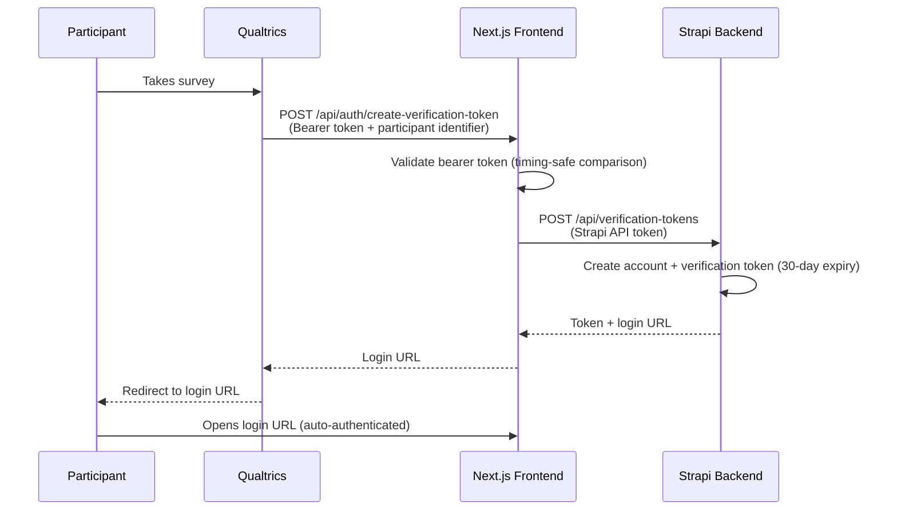

# Survey Platforms

GLHF integrates with **Qualtrics** and **Prolific** for survey distribution and participant recruitment.

## Qualtrics

Qualtrics integration handles automated survey distribution: importing participant emails into a mailing list, distributing personalized survey links, and sending reminders.

### Setup

1. **Create an OAuth2 application** in your Qualtrics account (Account Settings → Qualtrics IDs → OAuth)
2. **Grant scopes:** `write:mailing_list_contacts`, `write:distributions`, `read:distributions`
3. **Find your IDs** under Account Settings → Qualtrics IDs:
   - Datacenter ID
   - Directory ID
   - Survey ID, Library ID, Mailing List ID
   - Message IDs for invite and reminder templates

### Environment Variables

```bash
# OAuth2
QUALTRICS_CLIENT_ID=your_client_id
QUALTRICS_CLIENT_SECRET=your_client_secret

# IDs (found in Qualtrics IDs section)
QUALTRICS_DATACENTER_ID=oii.eu        # your datacenter
QUALTRICS_SURVEY_ID=SV_...
QUALTRICS_DIRECTORY_ID=POOL_...
QUALTRICS_MAILINGLIST_ID=CG_...
QUALTRICS_LIBRARY_ID=UR_...
QUALTRICS_MESSAGE_INVITE_ID=MS_...     # invite email template
QUALTRICS_MESSAGE_REMINDER_ID=MS_...   # reminder email template
```

### Cron Workflows

#### Email Import (`qualtricsEmailImport`)

- **Schedule:** `SURVEY_EMAIL_IMPORT_CRON_SCHEDULE` (default: every 2 hours)
- **Toggle:** `SURVEY_EMAIL_IMPORT_CRON_SCHEDULE_ENABLED`
- Finds consented participants not yet in Qualtrics
- Imports their email as a mailing list contact
- Replaces the stored email with a hashed version (`{hash}@{EMAIL_DOMAIN}`)
- Stores the Qualtrics `contactLookupId` and `qualtricsId` for later use

#### Survey Activation (`activateSurveys`)

- **Schedule:** `SURVEY_ACTIVATE_CRON_SCHEDULE` (default: every 15 minutes)
- **Toggle:** `SURVEY_ACTIVATE_CRON_SCHEDULE_ENABLED`
- Checks if participants have passed `STUDY_DAYS_BEFORE_SURVEY` since enrollment
- Distributes a personalized Qualtrics survey link to eligible participants
- Creates a reminder distribution for `STUDY_SURVEY_REMINDER_DAYS` days later
- If Discord is linked, sends the survey link via Discord DM
- Also checks for study completion (`STUDY_END_DAYS_AFTER_SURVEY`)

### Token Handling

The Qualtrics integration uses OAuth2 client credentials flow. Tokens are cached in memory (via `node-cache`) and automatically refreshed when expired. API calls use `axios-retry` with up to 3 retries and exponential backoff for rate limiting (HTTP 429).

### Automatic Sign-up via Survey (Web Service) {#sign-in-url-generation-web-service}

:::danger Experimental — not recommended for new studies
This feature is experimental and may be removed or significantly changed in a future release. We recommend using the standard sign-up flow (email, Google, or Discord) for new studies until this endpoint has a more secure implementation.

- **Token holder can act as any user** — Anyone with the shared access token can create accounts and generate login URLs for arbitrary identifiers. This means Qualtrics (or any service you share the token with) can create accounts and sign in as any user. Treat the token with the same care as a database credential.
- **Login URLs are replayable** — The generated login URL is valid for 30 days and is stored in the participant's browser history. Anyone with access to their browser history can use the URL to sign in as that participant.
- The endpoint is disabled by default — it is only active when `NEXT_INTERNAL_AUTH_VERIFICATION_SECRET` is set.
:::

As an alternative to the normal sign-up flow, participants can be **automatically signed up to GLHF** during a Qualtrics survey. A Qualtrics Web Service calls the GLHF platform to create an account and generate a login URL (valid for 30 days), which can be displayed to the participant at any point in the survey flow. This is completely separate from the standard email/Google/Discord sign-up — the participant never visits a registration page.

#### Flow



#### Qualtrics Web Service Setup

1. In your Qualtrics survey flow, add a **Web Service** element at the point where you want to generate the login URL
2. Configure the Web Service:
   - **Method:** POST
   - **URL:** `https://your-glhf-domain.com/api/auth/create-verification-token`
   - **Headers:**
     - `Content-Type: application/json`
     - `Authorization: Bearer <your-verification-secret>`
   - **Body (JSON):**
     ```json
     {
       "identifier": "${e://Field/ResponseID}@qualtrics"
     }
     ```
3. Set the `NEXT_INTERNAL_AUTH_VERIFICATION_SECRET` environment variable in the frontend to the same secret used in the `Authorization` header

#### Request / Response Example

**Request:**
```bash
curl -X POST https://your-glhf-domain.com/api/auth/create-verification-token \
  -H "Content-Type: application/json" \
  -H "Authorization: Bearer your-secret-here" \
  -d '{"identifier": "R_abc123def456@qualtrics"}'
```

**Response (200):**
```json
{
  "loginUrl": "https://your-glhf-domain.com/api/auth/callback/email?token=...&email=..."
}
```

---

## Prolific

Prolific integration supports participant recruitment workflows.

### Setup

Configure the Prolific environment variables:

```bash
PROLIFIC_DIGEST_CRON_SCHEDULE="0 7 * * *"     # daily at 7 AM
PROLIFIC_DIGEST_CRON_SCHEDULE_ENABLED=true
```

### Cron Workflow

#### Prolific Digest (`prolificDigest`)

- **Schedule:** `PROLIFIC_DIGEST_CRON_SCHEDULE` (default: daily at 7:00 AM)
- **Toggle:** `PROLIFIC_DIGEST_CRON_SCHEDULE_ENABLED`
- Processes Prolific participant data and triggers survey activation for Prolific-sourced participants

The `prolific-invite` API (`backend/src/api/prolific-invite/`) handles Prolific-specific recruitment logic, including email pattern detection for identifying Prolific-sourced participants.
