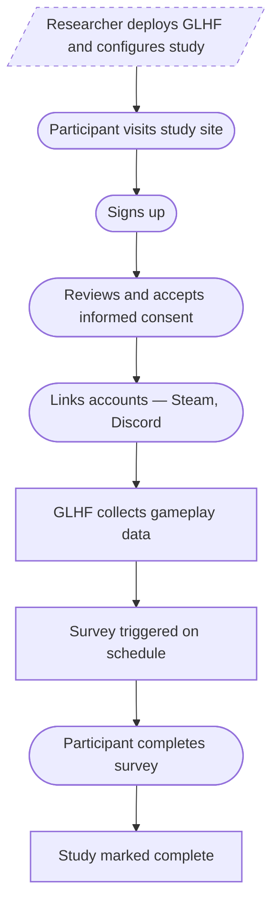

# Game Log Harvesting Framework

GLHF is an open-source, self-hosted data donation platform for gameplay behavior research. You deploy it on your own infrastructure — there is no hosted service. It provides a complete solution for researchers to collect consented play data from participants via Steam and Discord integrations, manage study participation workflows, and integrate with survey platforms like Qualtrics and Prolific.

## Key Capabilities

- **Informed consent** — No data collection begins until participants review and accept informed consent; participants can withdraw and request data deletion at any time
- **Steam integration** — Participants voluntarily link their Steam accounts; GLHF collects recently played games, owned games, and profile data via the public Steam API (requires participants to set game activity to public on their Steam profile)
- **Discord integration** — Participants link their Discord accounts and are automatically added to the study server; a Discord bot tracks gameplay activity via Rich Presence (what games participants are playing and when)
- **Configurable requirements** — Both Steam and Discord can be independently configured as required or optional for study activation
- **Survey integration** — Trigger Qualtrics surveys after configurable study periods, with automatic email import, distribution, and reminders. Prolific integration for recruitment workflows
- **Passwordless authentication** — Email magic links, Google OAuth, and Discord OAuth sign-in (separate from Discord account linking)
- **Configurable study timelines** — Define days before survey, survey expiration, reminder timing, and study completion
- **Researcher notifications** — Slack webhooks for study events
- **Self-hosted deployment** — Deploy to your own server with Docker Compose; your data stays on your infrastructure. SQLite for local development, PostgreSQL for production

## How It Works

After deploying GLHF to their own server, researchers configure their study — name, consent text, timeline, and survey settings — through the Strapi admin panel. Participants interact with a branded Next.js website where they sign up, give informed consent, and link their Steam and/or Discord accounts. Once linked, automated cron jobs handle gameplay data collection from both platforms, survey distribution via Qualtrics, and study completion tracking without further researcher intervention.

## Two Interfaces, Two Roles

The researcher and participant each have their own interface. Researchers manage content through the [Strapi admin panel](configuration/cms-content) — from study name and [consent text](configuration/cms-content) to [study timelines and survey settings](configuration/study-parameters). Participants see a website tailored to the study. For a deeper look at how these components connect, see the [Architecture](architecture) overview.

:::tip Try it yourself
Explore the participant-facing study website in the [**live demo**](https://glhf-lab.github.io/glhf/demo/) — a static, backend-free build with sample data. No sign-up required.
:::

**Participant · Study Website**

**Researcher · Strapi Admin**

:::warning Alpha Status
GLHF is in early alpha. The platform is functional and has been used in research studies, but APIs and configuration may change. We welcome feedback and contributions — see the [Contributing](contributing) page.
:::

## Next Steps

- [**Live Demo**](https://glhf-lab.github.io/glhf/demo/) — Click through the participant study website with sample data
- [**Getting Started**](getting-started) — Set up a local development environment and deploy
- [**Architecture**](architecture) — Understand how the pieces fit together
- [**Contributing**](contributing) — Help improve GLHF
